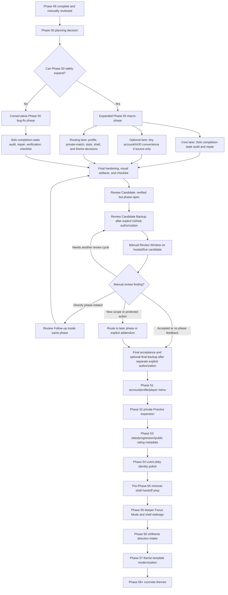

# Future Workflow Timeline

**Status:** Historical planning and discussion aid.
**Created:** 2026-07-06.
**Authority:** Supporting roadmap document only. It does not authorize implementation, tests, migrations, deployment, Git/GitHub work, backup workflow execution, release work, gameplay-rule changes, Elo changes, or work in the original stable `brrrdle` repository.

## Purpose

This document gives a single forward-looking view of the work currently routed after Phase 49. It is meant to help decide whether Phase 50 should become a larger macro-phase while keeping individual stages narrow, reviewable, and verification-friendly.

Closure update, 2026-07-08: Phase 50 was expanded into the macro-phase recommended here, iterated through the Review Candidate Backup Loop, manually accepted by the user, closed through the separately authorized Final Acceptance Backup, and captured with the Phase 50 Golden Checkpoint. Use the Phase 50 sections of this document as historical rationale and workflow guidance, not as an active Phase 50 prompt.

Forward-routing update, 2026-07-08: the user agrees with the Phase 51 account/Profile/player-identity direction and wants admin/backend visualization deferred. The user also wants a future GPT-5.6-oriented handoff-preparation step after the near-term foundation phases and before the deeper UI/theme work. That handoff step should strip visual ornamentation toward a minimal, terminal-like, fully playable shell while preserving all features and backend/gameplay behavior. The living blueprint is `planning/handoffs/GPT-56-MINIMAL-SHELL-HANDOFF-BLUEPRINT-2026-07-08.md`.

Phase 51 planning update, 2026-07-08: the canonical Phase 51 planning package is `planning/phase-51/PLANNING-BRIEF.md` and `planning/phase-51/IMPLEMENTATION-PLAN.md`. The next recommended gated action is bounded Phase 51 source/test implementation for account access, Profile simplification, source-only player-name policy, Profile/Settings account-management clarity, and a compact player chip/menu if it remains small and source-only.

Phase 51 closure update, 2026-07-09: Phase 51 account/Profile/player-identity work was accepted by the user and closed through the governed Final Acceptance Backup at commit `2edbe50aea68615a19255c36c6718d41c2671688`. Use `planning/phase-51/CHANGELOG.md` and `planning/phase-51/REVIEW-CHECKLIST.md` as accepted closeout records.

Phase 52 planning update, 2026-07-09: the canonical Phase 52 planning package is `planning/phase-52/PLANNING-BRIEF.md` and `planning/phase-52/IMPLEMENTATION-PLAN.md`. The next recommended gated action is bounded Phase 52 source/test implementation for private Practice matchmaking expansion: settings-aware unranked Practice OG/GO requests, word length, Hard Mode, supported time controls, GO puzzle-count handling, request lifecycle clarity, and focused real two-client E2E coverage. Admin/backend visualization, private Daily, ranked private challenges, opt-out/social graph work, and design-heavy shell work remain deferred.

Phase 52 implementation update, 2026-07-09: the private Practice matchmaking expansion Review Candidate is prepared. The next recommended gated action is the Phase 52 Review Candidate Backup so the user can test the hosted/live candidate while Phase 52 remains open for manual review follow-up.

Phase 52 manual acceptance update, 2026-07-09: the user reported that the hosted/manual review checklist appears to pass after PR #49. The next recommended gated action is the separately authorized Phase 52 Final Acceptance Closure and Backup, then Phase 53 planning for stats, progression transparency, and public rating/profile metadata.

Phase 52 closure update, 2026-07-09: Phase 52 private Practice matchmaking expansion was accepted by the user and closed through the governed Final Acceptance Backup at commit `9f0096c839ac007d2717f2b7a0ba91541f18ed4d`. Use `planning/phase-52/CHANGELOG.md` and `planning/phase-52/REVIEW-CHECKLIST.md` as accepted closeout records.

Phase 53 planning update, 2026-07-09: the canonical Phase 53 planning package is `planning/phase-53/PLANNING-BRIEF.md` and `planning/phase-53/IMPLEMENTATION-PLAN.md`. The next recommended gated action is bounded Phase 53 source/test implementation for Stats clarity, progression transparency, cloud-sync provenance copy, local multiplayer performance summaries, and privacy-safe public rating/profile metadata using existing public profile and leaderboard contracts unless a later addendum is explicitly authorized.

Phase 53 implementation update, 2026-07-09: the Phase 53 Stats/progression/public metadata Review Candidate is prepared. The implementation separates private Stats data sources, Solo summaries, progression transparency, local multiplayer performance cache, charts, public site aggregate stats, and public profile ranked Practice metadata using only existing source data and existing public profile/leaderboard contracts. The next recommended gated action is the Phase 53 Review Candidate Backup so the user can test the hosted/live candidate while Phase 53 remains open for manual review follow-up.

Phase 54 manual acceptance update, 2026-07-09: the user completed the hosted/manual Phase 54 Review Candidate checklist after PR #53 and reported that every item passes, with no direct Phase 54 follow-up. The next recommended gated action is the separately authorized Phase 54 Final Acceptance Closure and Backup. After closure, prepare a separate Phase 54 Golden Checkpoint prompt for the actual closure commit before beginning the already-routed Pre-Phase-55 minimal-shell and GPT-5.6 handoff-preparation planning.

The current recommendation is to make Phase 50 larger than recent phases only if it remains cohesive:

- one urgent repair lane for Solo completion-state persistence;
- one small current-surface convenience lane if the audit proves it is source-only and low risk;
- one documentation/routing lane for larger profile, private-match, stats, shell, and theme decisions.

The phase can be bigger. The stages should stay small.

## Current Baseline

- Phase 50 is complete, backed up, merged, branch-cleaned, manually reviewed, and captured with the Golden Checkpoint.
- Current accepted Phase 50 closure commit: `a8f7fdeb0bfdfd5f25f68c7531588d65b87d7ede`.
- Phase 50 Golden Checkpoint tag: `phase-50-golden-2026-07-08`.
- Phase 51 account/Profile/player-identity work is complete, manually accepted, backed up, merged, branch-cleaned, and closed at commit `2edbe50aea68615a19255c36c6718d41c2671688`.
- Phase 52 private Practice matchmaking expansion is complete, manually accepted, backed up, merged, branch-cleaned, and closed at commit `9f0096c839ac007d2717f2b7a0ba91541f18ed4d`.
- Phase 53 stats/progression/public metadata work is complete, manually accepted, backed up, merged, branch-cleaned, and closed at commit `52b44d3e533baa200d57b36af6ea5d33c7ddde97`.
- Phase 54 Live/Lobby identity and spectator-adjacent polish is manually accepted after Review Candidate PR #53 and is ready for separately authorized final acceptance closure.
- The original stable `brrrdle` repository remains untouched.
- Latest Phase 50 closure record: `progress/PROGRESS-STEP-500.md`.
- Latest Phase 51 closure record: `progress/PROGRESS-STEP-506.md`.
- Latest Phase 52 acceptance-prep record: `progress/PROGRESS-STEP-509.md`.
- Latest Phase 53 closure record: `progress/PROGRESS-STEP-512.md`.
- Latest Phase 54 acceptance-preparation record: `progress/PROGRESS-STEP-515.md`.

## Current Problem To Prioritize

The first real follow-up is not cosmetic. It is a Solo completion-state persistence bug:

- Daily Solo OG/GO and Practice Solo OG/GO can lose the final winning guess and completed end screen after the player wins, navigates away, and returns.
- Browser Back/Forward and ordinary route navigation can both trigger the issue.
- Incorrect valid guesses appear to persist correctly.
- Intermediate GO solved puzzles appear to persist correctly.
- XP, coins, level, and rewards do not appear to double-award after re-submitting, which is good and must be preserved.

That makes Phase 50 a better fit for Solo completion-state persistence than theme modernization.

## Big Phase, Small Stages

The phase scope sizing guide supports larger macro-phases when related work shares a user journey, data path, verification harness, or UI ownership. The safe pattern is:

- broaden the phase only around compatible work;
- keep each stage single-purpose;
- place audit and source-only-versus-addendum decisions before source edits;
- run focused tests after each source slice;
- save broad verification and visual review for final hardening.

For Phase 50, this means it is reasonable to consider a larger macro-phase, but not a grab bag.

## Recommended Phase 50 Shape

### Core Lane: Solo Completion Persistence

This lane should be in Phase 50.

Goals:

- reproduce or characterize the missing final winning guess and end-screen state for Daily Solo OG, Daily Solo GO, Practice Solo OG, and Practice Solo GO;
- audit route re-entry, browser Back/Forward, active progress, resume slots, storage writes, route cache, and completion-state hydration;
- repair the final completion persistence path if source-only is safe;
- preserve reward idempotence for XP, coins, level, stats, Daily claims, and progression rewards;
- preserve Phase 49 Progression HUD and Focus Mode behavior.

Likely stages:

1. Protected baseline and review intake.
2. Read-only Solo completion-state audit and reproduction.
3. Source-only versus storage/reward-contract decision.
4. Source/test repair for Solo completion-state persistence.
5. Focused reward idempotence and re-entry regression coverage.

### Optional Small Convenience Lane

This lane can be included in a larger Phase 50 only if the Phase 50 planning brief keeps it modest and stage-separated.

Good candidates:

- add a signed-in Sign out action back to Profile while preserving Settings as the account-management home;
- add a direct Profile-to-Settings Account Management button or deep link where copy tells users those controls live in Settings;
- make the Progression HUD clickable to Stats if it remains display-only and does not expose new public data;
- route Focus Mode preference/player-chip ideas without implementing persistent preferences yet.

Why these are plausible:

- they are visible current-surface cleanup items;
- they do not inherently require storage/RLS changes if kept source-only;
- they can be tested with focused component/UI tests.

Why they should stay optional:

- Profile/Auth/Settings are account-sensitive surfaces;
- player-chip popovers and persistent Focus Mode preferences could become shell/account-preference contract work;
- too many UI conveniences can distract from the urgent Solo completion bug.

### Documentation/Routing Lane

This lane should be included in Phase 50 if the user wants a bigger phase but does not want risky implementation sprawl.

Route, but do not implement yet:

- deeper Focus Mode that removes more page chrome;
- persistent Focus Mode preference in Settings;
- top-right player chip/popover with Profile, Settings, Sign out, sound, and Focus controls;
- broader desktop/mobile side-panel or compact navigation redesign;
- top-right Daily button consolidation;
- simplified public-by-default multiplayer profile model;
- private Practice request expansion to public profiles, GO, custom settings, inbox/outbox, and request opt-out settings;
- Stats clarity for Solo versus multiplayer, cloud-synced stats, and multiplayer performance stats;
- clickable Live/Lobby player names and safe Elo/rating metadata;
- theme/UI direction intake before theme templates are modernized.

## Recommended Timeline

| Phase | Recommended Focus | Implementation Level | Notes |
| --- | --- | --- | --- |
| Phase 50 | Solo completion-state persistence plus narrow review routing | Source/test for Solo bug; optional tiny UI convenience; documentation routing | Best next larger macro-phase if kept staged. |
| Phase 51 | Account access, Profile simplification, and player-chip/menu design | Complete | Closed at commit `2edbe50aea68615a19255c36c6718d41c2671688`. |
| Phase 52 | Private Practice matchmaking expansion | Complete | Settings-aware unranked Practice OG/GO requests, custom Practice settings, inbox/outbox clarity, and E2E coverage; opt-out controls remain deferred. |
| Phase 53 | Stats, progression transparency, and public rating/profile metadata | Complete | Closed at commit `52b44d3e533baa200d57b36af6ea5d33c7ddde97`. |
| Phase 54 | Live/Lobby identity and spectator-adjacent polish | Manual review accepted; Final Acceptance Backup prepared | Authenticated participant profile links and return routing reuse existing contracts; Lobby and spectator identities remain display-only unless a separately authorized migration/RLS addendum is approved. After closure, create a Golden Checkpoint before handoff preparation. |
| Pre-Phase-55 handoff prep | Minimal-shell simplification and GPT-5.6-oriented handoff package | Source/CSS simplification plus documentation, after separate authorization | Strip nonessential visual ornament while preserving functionality; prepare handoff for later frontend/design work. |
| Phase 55 | Focus Mode expansion and mobile/desktop shell redesign | UI-heavy; likely broad visual review | Deeper Focus Mode, route rail/side-panel concepts, top-right Daily button consolidation, after handoff prep. |
| Phase 56 | UI/theme direction intake and design system planning | Planning/design first | Capture visual direction, inspiration sites, generated concept options if authorized, and design-system strategy. |
| Phase 57 | Theme proposal/template modernization | Planning/source docs; possible assets later | Update old theme templates after shell/profile/social surfaces settle. |
| Phase 58+ | Concrete themes and polish | Dedicated cosmetic implementation | Implement selected themes, assets, sounds, and full theme QA. |

## Current Phase 51 Intake Update

The user has accepted the account/Profile/player-identity scope direction for Phase 51 and does not currently want additional Phase 51 items beyond that scope.

Phase 51 should:

- avoid gameplay mechanics and backend gameplay persistence changes except to preserve accepted behavior;
- focus on account/Profile/player identity and related Profile/Settings routing;
- evaluate single public player name versus separate private/public profile names;
- evaluate emoji/special-character player-name policy;
- evaluate a compact player chip/menu if it reduces account-control confusion without beginning a broad shell redesign;
- clarify Sign out, Settings, Profile, account-management, and Danger Zone placement;
- preserve the accepted Phase 50 gameplay baseline.

Phase 51 should not implement admin multiplayer queue visualization or backend observability UI. It may document a placeholder or later-phase concept if useful.

Design-heavy homepage widgets, broad visual refresh, theme work, new UI toolkit adoption, and image-generation concept work should be routed to the later handoff/design process rather than Phase 51.

## Review Candidate Backup Loop

Future phases should use a Review Candidate Backup Loop instead of forcing all manual review to happen before GitHub backup:

1. Final hardening creates a Review Candidate with verification evidence, local/Codex-browser preview instructions when useful, ignored visual artifacts, and the manual checklist.
2. The user may explicitly authorize a Review Candidate Backup so the candidate is available through the normal GitHub-backed hosted/live surface for desktop and mobile testing.
3. The phase remains open after that backup; it is not finally accepted, closed, released, or advanced.
4. The user gets a Manual Review Window on the hosted/live candidate. This is where checklist findings, device observations, local-preview observations, and visual-artifact concerns can be reported.
5. Directly phase-related findings may be fixed through a Review Follow-up inside the same phase, then the phase returns to Review Candidate.
6. Repeat Review Candidate Backup and Manual Review Window as needed.
7. Broader findings are routed to a later phase or explicit addendum.
8. Final phase closure and any Final Acceptance Backup happen only after manual review is accepted and a separate current prompt authorizes the protected Git/GitHub action.

## Workflow Diagram

## Items Safe To Consider For A Larger Phase 50

| Candidate | Recommendation | Reason |
| --- | --- | --- |
| Solo completion-state persistence | Include | Urgent user-reported bug, same Solo storage/navigation/reward path. |
| Completion reward idempotence regressions | Include | Must be verified with the Solo completion repair. |
| Profile Sign out convenience | Optional stretch | Likely source-only, but touches account/auth UI and should be isolated. |
| Profile-to-Settings Account Management deep link | Optional stretch | Small UX convenience if route/scroll targeting stays bounded. |
| Progression HUD click-through to Stats | Optional stretch | Related to Phase 49 HUD, but should remain display-only and local UI-only. |
| Focus Mode Settings preference | Route only unless proven tiny | Persistence may involve guest/account settings semantics. |
| Player-chip popover | Route only | Useful, but shell/account/control surface is broader than the Solo bug. |
| Public-by-default profile simplification | Route only | Likely privacy/model/RLS decision work. |
| Private Practice expansion | Route only | Likely social/request lifecycle and Supabase/RLS work. |
| Stats cloud sync or multiplayer stats | Route only | Likely storage/model and product-definition work. |
| Live/Lobby Elo/profile metadata | Route only | Public identity and privacy boundaries need dedicated gates. |
| Broad shell/side-panel redesign | Defer | High visual and navigation blast radius. |
| Theme modernization | Defer | User has additional UI/theme direction to share first. |

## Hard Deferrals

Do not pull these into Phase 50 without a later explicit change in authorization:

- private Daily implementation;
- ranked Daily implementation;
- strict one-active-session/session leases;
- server-authoritative Daily submissions;
- service workers/push infrastructure;
- spectator presence/count/list;
- production deployment or release;
- broad mobile/desktop shell redesign as an implementation item;
- compact side-dock implementation;
- gameplay-rule changes;
- Elo algorithm changes;
- full theme implementation.

## Suggested Decision Points For The User

Before creating the Phase 50 planning brief, decide:

1. Should Phase 50 be bug-only, or an expanded macro-phase?
2. If expanded, should it include one small convenience implementation slice, or only documentation routing beyond the Solo bug?
3. Which tiny convenience item is highest value: Profile Sign out, Profile-to-Settings deep link, or HUD click-through to Stats?
4. Should all theme work wait until after a dedicated UI/theme direction intake phase? The current recommendation is yes.

## Recommended Next Move

Create the Phase 50 planning brief as a larger macro-phase with this structure:

- primary source/test lane for Solo completion-state persistence;
- optional tiny source-only convenience lane, gated by audit;
- documentation/routing lane for Focus Mode, account/profile, private Practice, Stats, Live identity, shell, and themes;
- explicit deferral of theme modernization until after UI/theme direction intake.

This gives Phase 50 more useful payload without letting it become a sprawling, high-risk implementation bundle.
